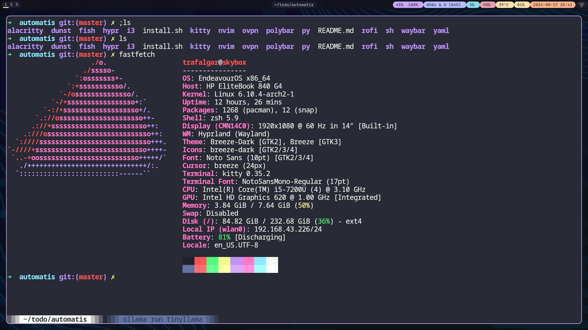
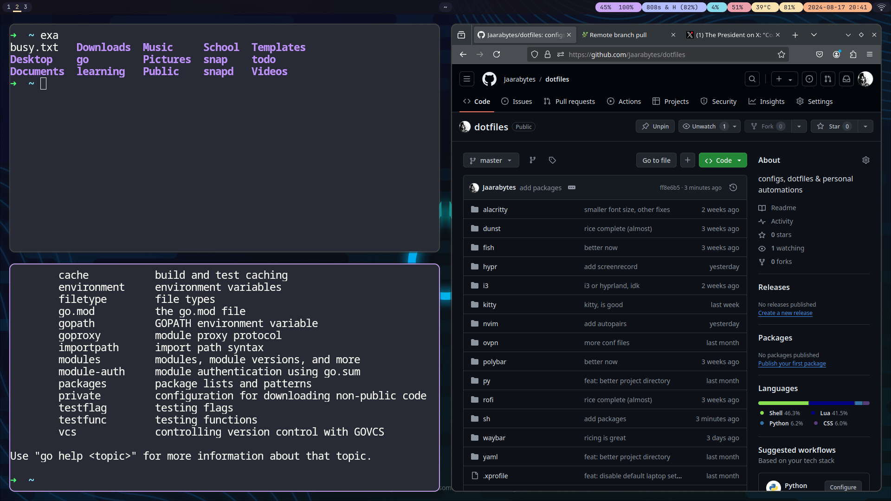

# Dotfiles

You are highly welcome to ~~steal~~ clone them

Primarily I use arch linux, with hyprland but i3 is also great.

Just:

```bash
git clone git@github.com:Jaarabytes/dotfiles.git
cd dotfiles
chmod +x start.sh
./start.sh
```

## Preview with Hyprland



