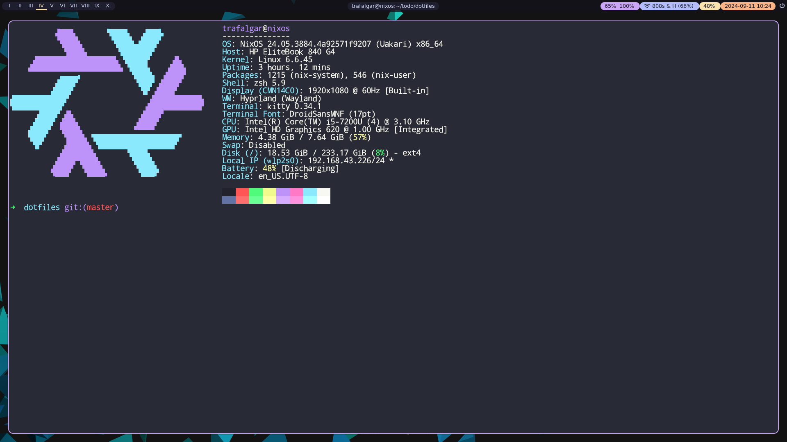

# Dotfiles

You are highly welcome to ~~steal~~ clone them

Primarily I use **Nix OS** ~~arch linux~~, with hyprland but i3 is also great.

Just:

```bash
curl -fsSL https://raw.githubusercontent.com/Jaarabytes/dotfiles/master/install.sh | sh
```

## Nix OS btw



## I use arch btw


